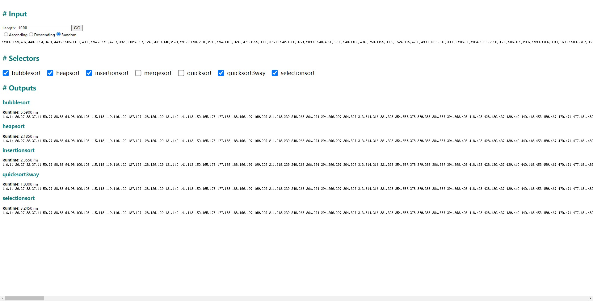
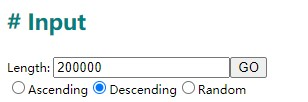
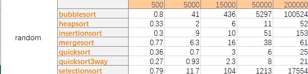
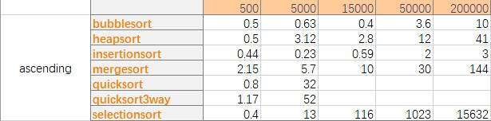
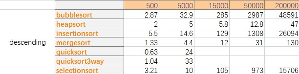
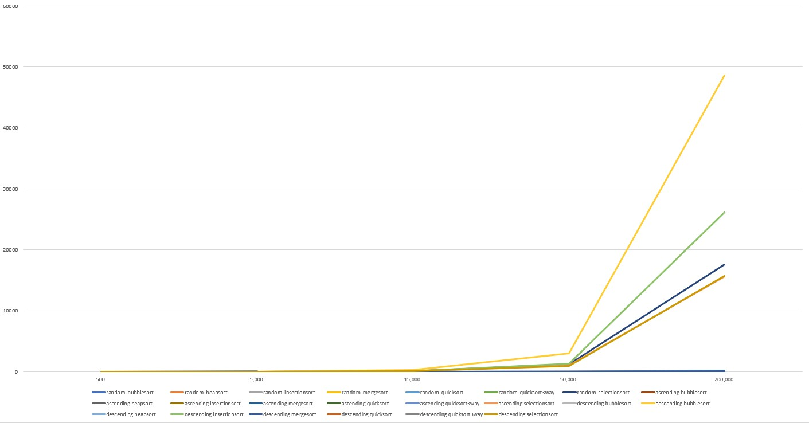
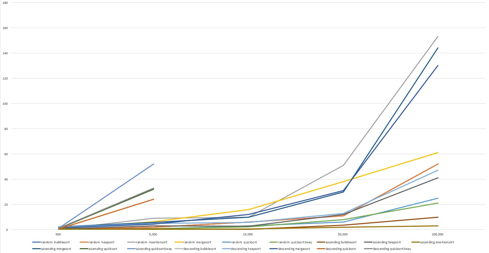

# Project Report

**net_id**: gxt8594

**implementation**: Project 1 (Sorting Algorithm)

**env**: web app

**language**: typescript

**github repo**: https://github.com/Astroleander/uta-5311-project

## Run project on web
1. install node v10+ (v8 maybe ok but i didn't try)
2. clone project
3. execute `yarn install` at `./`
4. execute `yarn run start`, the project run at `localhost:9090`

Every step is **required** and should be ok for any platform.

## Showcase Overview



The project app contains few parts ——

1. **Input** —— Modify Input generation rules

2. **Selector** —— Choosing witch algos to display

3. **Output** —— Showing result and running time of selected algorithms

## Structure Overview

```
src
 | - code              => algos
 | - container         => react app
 | - util       
 |    | - route        => path parser
 |    | - utils       
 |        
 | - index.html        => webpack html template
 | - index.tsx         => react dom loader
 |
... configs & documents 
```

## Algorithm Details

All sorting algorithms at path `./src/code/`.

All sorting algorithms require the same args —— an unsorted array, and return sorted array itself.

This project use ECMA6 style to export algo as a module whitch contains a function. The web app will call the function at running.

```ts
export default function xxxsort(arr) {
  // sort here
  return arr;
}
```

The only package imported in algos files is `swap` which is a swap helpper wrapped in `/src/utils/utils`
```ts
export const swap = (arr, a, b) => {
  let tmp = arr[b];
  arr[b] = arr[a];
  arr[a] = tmp;
}
```

## Structure Details

The web app construct by webpack + react + typescript.

Webpack is responsed to **compile & build** different files into html/css/js

React supports a functional way to construct modern web gui.

All framework code at path `./src/container`

```
container
    |- App              => Layout Controller, the main page owner
    |
    |- Container *      => Sorting Algorithm Container, 
    |                      1. call algorithms 
    |                      2. count running time 
    |                      3. and print outputs 
    |
    |- Input            => The place where you can modify inputs
    |
    |- Output           => Contains multiple Container
    |
    |- Selector         => The place where you can modify which algo to use and display
    |
    |- style            => css files to stylish the web page
index.html              => webpack html entry template
index.tsx               => webpack js entry, 
                           the place where react is loaded and injected
```

Container hot load the algorithm module and using High Resolution Time api to measure runtimes (ms)

## Inputs


Input is auto-generated, the default inputs scope is 1000 size and in random order.
The genenrator code is in `./src/container/Input.tsx`

# Analysis

> limited by explorer memory alloc strategy, the biggest input scope is far more small than other platform



*Analysis-1 random inputs running times*



*Analysis-2 anscending inputs running times*



*Analysis-3 descending inputs running times*

> Quick Sort failed because of Maximum Call Stack reached in ascending & descending big scale case



*Analysis-4 comparing of all algos*

The algorithm costs O(n^2) increse rapidy with scale increse.



*Analysis-5 comparing of all optimal algos*